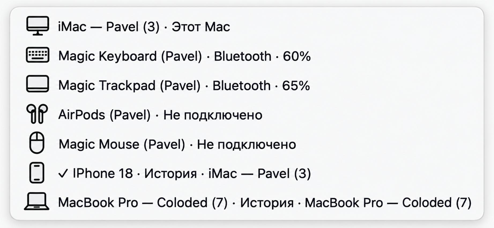
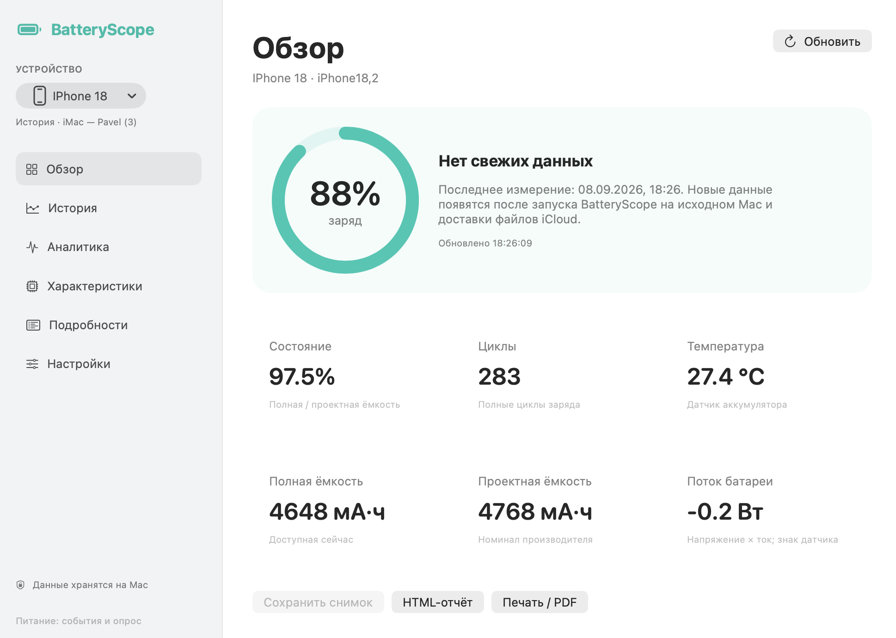
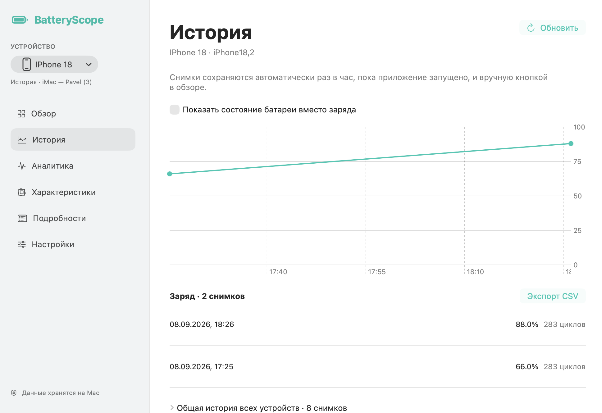
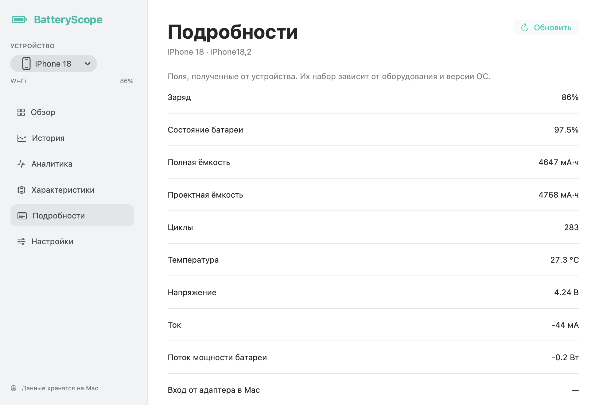
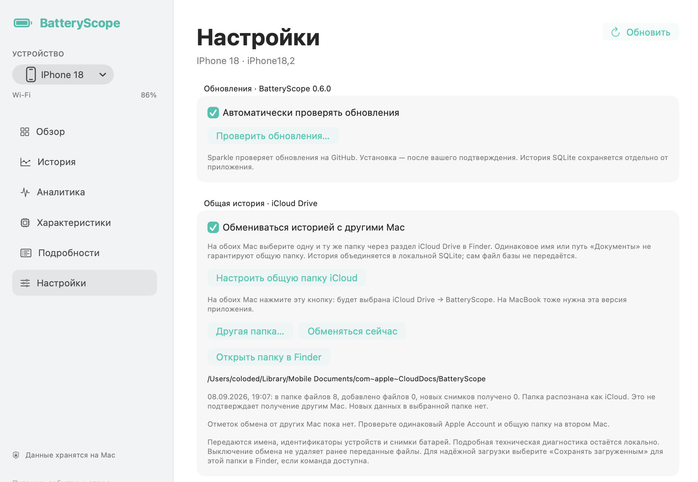

# BatteryScope

Нативное приложение для macOS: заряд и состояние батарей Mac, подключённых iPhone/iPad и доступных Bluetooth-аксессуаров Apple. История хранится локально в SQLite; обмен между Mac можно включить через iCloud Drive.

[Скачать последнюю версию](https://github.com/Coloded/batteryScope/releases/latest) · [Установка и обновления](docs/UPDATES.md)

Поддерживаются Apple Silicon и Intel, macOS 13+. Утилиты для iPhone/iPad встроены. Доступность показателей зависит от устройства. Установщик не содержит пользовательскую базу; обновление сохраняет имеющуюся историю.

## Сборка из исходников

Нужны Apple Command Line Tools с SDK macOS 26+ и `pkgconf`. Минимальная система для готового приложения — macOS 13.

```sh
bash scripts/build.sh
bash scripts/test.sh
```

Путь к готовому приложению выводит скрипт. Подготовка установщика, подписи и канала обновлений описана в [инструкции по выпуску](docs/UPDATES.md). Исходники и лицензии встроенных библиотек описаны в [ThirdParty](ThirdParty/README.md).

## Инструкция в картинках

Инструкция для BatteryScope 0.6.0: четыре скриншота и меню, перерисованное по фотографии. Иллюстрации предоставлены для инструкции; показания относятся к моменту съёмки.

[Отдельная инструкция](docs/guide/README.md)

### 1. Выбор устройства

Откройте меню в левом верхнем углу и выберите Mac, iPhone или аксессуар. Галочка отмечает выбранное устройство; текущий раздел при переключении сохраняется. Подпись «История» означает архивные измерения. «Не подключено» означает, что устройство сейчас недоступно — это не текущий заряд.



*Иллюстрация меню устройств: иконки и состояние подключения.*

### 2. Обзор и свежесть показаний

Нажмите «Обновить», чтобы запросить показания. Надпись «Нет свежих данных» означает, что показан сохранённый снимок: смотрите дату последнего измерения. Для удалённого Mac запустите BatteryScope на нём и дождитесь обмена iCloud. Кнопка «Сохранить снимок» доступна для подходящих текущих показаний; «HTML-отчёт» и «Печать / PDF» создают отчёт.



*Обзор архивного снимка. Цифры на иллюстрации относятся к моменту съёмки.*

### 3. История и экспорт

Приложение сохраняет снимки автоматически раз в час, пока работает; снимок также можно сохранить вручную из обзора. В истории выбранного устройства переключатель меняет показатель графика: заряд или состояние батареи. «Экспорт CSV» сохраняет таблицу. Раскройте «Общая история всех устройств» для общего списка.



*График и список сохранённых измерений.*

### 4. Подробности и мощность

В разделе «Подробности» показаны доступные поля устройства. Прочерк означает отсутствие данных. Поток мощности батареи рассчитывается по напряжению и току и отличается от входа адаптера и потребления системы. Знак потока следует показанию датчика. Набор полей зависит от устройства. Для расширенных сведений откройте «Характеристики» и запросите чтение.



*Доступные значения батареи и питания. Это реальные сохранённые иллюстрации, а не обещание одинаковых датчиков на всех устройствах.*

### 5. Обновления и общая история iCloud

На каждом Mac установите актуальную версию через «Проверить обновления…». Включите iCloud Drive с одной учётной записью Apple. Затем на каждом Mac нажмите «Настроить общую папку iCloud»: приложение выберет iCloud Drive → BatteryScope. Нажмите «Обменяться сейчас» и проверьте статус. Запись файла и отправка в iCloud ещё не подтверждают получение вторым Mac — смотрите отметки других участников. Одинаковое имя локальной папки «Документы» на двух Mac не делает её общей.



*Настройки обновлений и обмена историей; на снимке ещё нет подтверждения другого Mac.*

### Подключение и хранение

Для iPhone: подключите кабелем, разблокируйте и подтвердите доверие. Для последующего поиска по Wi-Fi включите показ iPhone по Wi-Fi в Finder и «Искать iPhone/iPad по Wi-Fi» в BatteryScope. Mac и телефон должны быть доступны в одной локальной сети. История хранится отдельно от приложения в SQLite и сохраняется при обновлении.
